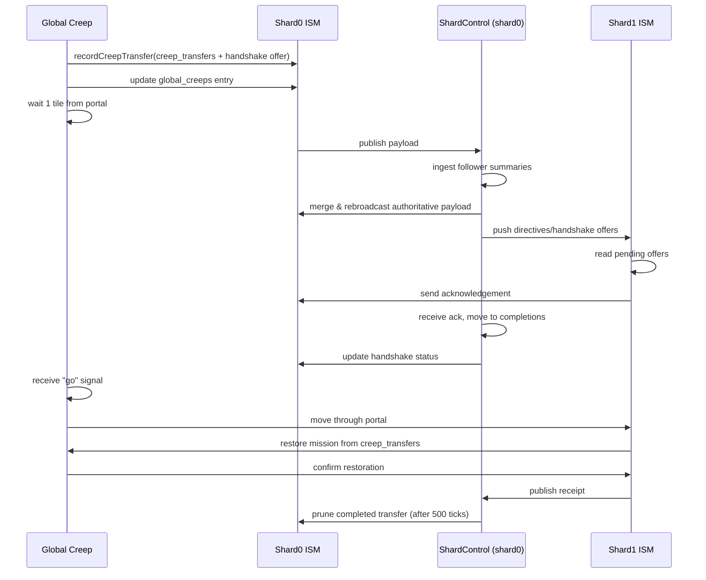

# Inter-Shard Travel Playbook

Cross-shard operations unlock new frontier rooms, markets, and strategic vision. This guide explains how the refactored inter-shard travel stack works, outlines the mission fields that **must** be populated, and finishes with a fully vetted `empire.scout()` command you can paste into the Screeps console.

---

## System Overview

- **Mission Queue (`empire.scout`)** – accepts shard-qualified rooms and serializes the request into `Memory.rooms[<colony>].scout_requests`. All positions can (and should) include a `shard` property when the target is off-shard.
- **Travel Layer** – `Creep_Roles.Scout` cooperates with the refreshed `travelToRoom` helper to follow shard-aware `list_route` entries (`shard/room` strings or `{ shard, roomName }` objects) and portal lookups.
- **Inter-Shard Memory (ISM)** – prior to stepping through a portal, the creep snapshots its memory into ISM and registers itself with `ShardMemory`. When it appears on the remote shard, the scout reconstructs its mission by reading (in order) the portal snapshot, global mission cache, and, if needed, the originating colony’s `scout_requests`.
- **Global Manifest** – every scout pushes a descriptor into the shard manifest each tick. Dead creeps are pruned automatically; `shards.global()` will only list live or freshly transferring scouts.

---

## Inter-Shard Memory Architecture

- **Control Shard (`shard0`)** – considered the primary shard. `ShardControl` on shard0 ingests status packets from all follower shards, reconciles global creep manifests, and issues directives back out through ISM. The primary shard is the only place where cross-shard requests are dequeued and converted into spawn directives.
- **Follower Shards (`shard1`–`shard3`)** – publish their local state (global creeps seen, portal activity, receipts) into their own ISM slot. They never mutate another shard’s payload directly; instead, shard0 reads, merges, and echoes authoritative data back.
- **Serialized Payload** – every shard owns a JSON document capped at ~95 KB. `ShardMemory` ensures a consistent structure:
  - `summary` – heartbeat counters, last sync times, CPU queues
  - `global_creeps` – manifest entries keyed by creep name, including mission tags, shard/room, ttl, and lifecycle stage
  - `creep_transfers` – portal snapshots containing serialized creep memory, transfer metadata, and timestamps
  - `requests` / `directives` / `receipts` – bounded queues used for resource asks, mission orders, and acknowledgements
- **Data Flow** – when a creep prepares to cross shards, it writes a snapshot into `creep_transfers` within the *local* shard payload and updates its manifest entry. The system uses a three-phase handshake to ensure data integrity:
  1. **Offer**: Origin shard registers a handshake offer in `handshake.pending` and the creep waits one tile from the portal
  2. **Acknowledgment**: Destination shard reads the offer from primary directives and sends an acknowledgment via `handshake.acknowledgements`
  3. **Completion**: Primary shard receives the ack, moves the handshake to `handshake.completions`, and the creep proceeds through the portal
- **Retention Rules** – cleanup pulses respect cross-shard hand-offs: `creep_transfers` entries tagged with a different `destination_shard` persist for 1500 ticks to guarantee the remote shard can fetch them. Completed handshakes are retained for 500 ticks before automatic purging.
- **Pulse Frequency** – the intershard pulse runs every 3-10 ticks for responsive handshake coordination and data synchronization.



---

## Key Requirements

1. **Portal Map** – provide both outbound and return portals. Each entry is a `{ from, to, label }` object where `from.pos` is the tile the scout must stand on.
2. **Shard Qualified Rooms** – everywhere that can exist on multiple shards (`colony`, `spawnRooms`, `list_route`, `rally_pos`, `dest_pos`) should include a shard tag.
3. **ES5 Console Syntax** – Screeps’ console does not support `let`, `const`, or optional chaining. Stick to classic object literals and `var`.
4. **Mission Lifecycle** – give every scout a unique request via `empire.scout()` and allow the control loop to manage `scout_requests`. Manual edits can be overwritten if the request data is missing required fields.

---

## Mission Field Reference

| Field                     | Purpose                                 | Notes                                                                               |
|---------------------------|-----------------------------------------|-------------------------------------------------------------------------------------|
| `colony`                  | Origin shard and room (`shard0/E48S21`) | Determines which memory bucket stores the mission.                                  |
| `spawnRooms`              | Assisted spawns                         | Optional, defaults to colony’s assist list.                                         |
| `rally_pos`               | `{ x, y, roomName, shard }`             | Starting staging tile; turn off `wait_for_full_rally` if you want immediate launch. |
| `dest_pos`                | `{ x, y, roomName, shard }`             | Final patrol waypoint used by the role loop.                                        |
| `list_route`              | Ordered rooms (strings or objects)      | Include intermediate shard transitions (`shard1/E30S10`).                           |
| `patrol_mode`             | `"station"` or `"loop"`                 | `"loop"` will bounce between `rally_pos` and `dest_pos`.                            |
| `wait_for_full_rally`     | `true/false`                            | Set `false` for single-scout missions to avoid staging delays.                      |
| `transfer_intent`         | Portal metadata                         | See example below; `return_portal` is optional but recommended.                     |
| `transfer_intent.portals` | Array of portal waypoints               | Each entry needs `from.pos.{x,y,roomName,shard}` and `to.{shard,roomName}`.         |
| `custom`                  | Spawn overrides                         | `priority`, `level`, or a named body template.                                      |

> **Tip:** The control loop now snapshots `mission_data` into the scout’s global memory. If a creep lands on a shard with partially missing data, the next tick will automatically reconstruct the full request.

---

## Fully Vetted `empire.scout()` Example

The snippet below launches a level 3 scout from `shard0/E48S21`, rallies in `shard0/E50S20`, travels through the portal at `(45,24)`, scouts `shard1/E30S14`, and loops back through the return portal at `(13,20)`.

```javascript
empire.scout({
  colony: 'shard0/E48S21',
  spawnRooms: ['E52S21'],
  rally_pos: { x: 45, y: 29, roomName: 'E50S20', shard: 'shard0' },
  dest_pos: { x: 15, y: 25, roomName: 'E30S14', shard: 'shard1' },
  list_route: [
    'E48S21',
    'E49S21',
    'E49S20',
    'E50S20',
    'shard1/E30S10',
    'shard1/E30S14'
  ],
  patrol_mode: 'loop',
  wait_for_full_rally: false,
  transfer_intent: {
    destination_shard: 'shard1',
    destination_room: 'E30S14',
    portal_pos: { x: 45, y: 24, roomName: 'E50S20', shard: 'shard0' },
    return_portal: {
      shard: 'shard1',
      portal_pos: { x: 13, y: 20, roomName: 'E30S10', shard: 'shard1' },
      destination_shard: 'shard0',
      destination_room: 'E50S20'
    },
    portals: [
      {
        from: {
          shard: 'shard0',
          roomName: 'E50S20',
          pos: { x: 45, y: 24, roomName: 'E50S20', shard: 'shard0' }
        },
        to: { shard: 'shard1', roomName: 'E30S10' },
        label: 'outbound'
      },
      {
        from: {
          shard: 'shard1',
          roomName: 'E30S10',
          pos: { x: 13, y: 20, roomName: 'E30S10', shard: 'shard1' }
        },
        to: { shard: 'shard0', roomName: 'E50S20' },
        label: 'return'
      }
    ]
  },
  custom: {
    priority: 10,
    level: 3
  }
});
```

### After Launch

- **Verify:** `shards.global()` should list the new scout as `active` with the correct mission.
- **Monitor:** `Mission.scout_requests` will auto-prune creeps that die; the global manifest is also cleaned during the short pulse.
- **Troubleshoot:** If a scout pauses near a portal, confirm the tile isn’t occupied and that the `portals` array contains the exact coordinates.

---

## Troubleshooting Checklist

1. **Scout stuck at rally** – ensure `wait_for_full_rally` is `false` for single-creep missions.
2. **Scout stuck near portal** – the creep is waiting for handshake acknowledgment. Check handshake state:
   ```javascript
   // ES5-compatible handshake check
   JSON.stringify((function(){
       var ism=InterShardMemory.getLocal();
       if(!ism)return{error:'No ISM'};
       var data=JSON.parse(ism);
       var pending=(data.handshake&&data.handshake.pending)||{};
       var acks=(data.handshake&&data.handshake.acknowledgements)||{};
       var completions=(data.handshake&&data.handshake.completions)||{};
       return{
           shard:Game.shard.name,
           tick:Game.time,
           pending:Object.keys(pending),
           acks:Object.keys(acks),
           completions:Object.keys(completions)
       };
   })(),null,2);
   ```
3. **No portal entry warning** – confirm the `portals` array covers both outbound and return portals and that `portal_pos.roomName` matches the actual room.
4. **Memory did not restore** – check ISM snapshots via `InterShardMemory.getLocal()`. Missing data usually indicates the scout did not step onto the portal tile (range > 0) or the handshake did not complete.
5. **Duplicate spawns** – let the control loop prune dead creeps (added cleanup handles this automatically). Avoid manual edits to the `scout_requests` unless you update the entire mission object.
6. **Handshake not completing** – verify the intershard pulse is active on both shards:
   ```javascript
   // Check pulse status
   Memory.hive.pulses.intershard
   ```
   If `active: false`, enable it: `Memory.hive.pulses.intershard.active = true;`

For deeper debugging helpers, run:

```javascript
shards.global('scou:example');
Control.runScoutRequests('E48S21');
```

These calls expose the manifest entry and re-run the scout control loop respectively.

### Handshake System Notes

- **Creeps wait for acknowledgment**: Scouts will stop one tile away from the portal until the destination shard acknowledges the transfer
- **Fast response**: The intershard pulse runs every 3-10 ticks, so handshakes typically complete within 10-20 ticks
- **Automatic cleanup**: Completed handshakes are purged after 500 ticks to prevent memory bloat
- **In-memory cache**: All ISM operations within a single tick use an in-memory cache to prevent stale data issues

---

With the fields above in place, inter-shard scouts will traverse portals, restore their mission state on arrival, and keep the global manifest accurate without manual cleanup.

